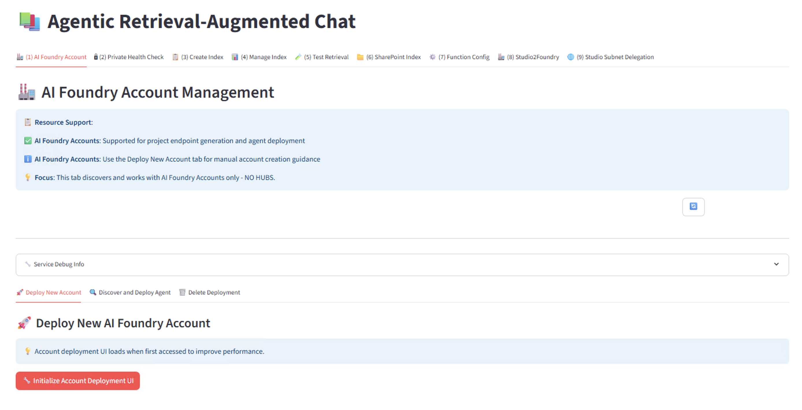
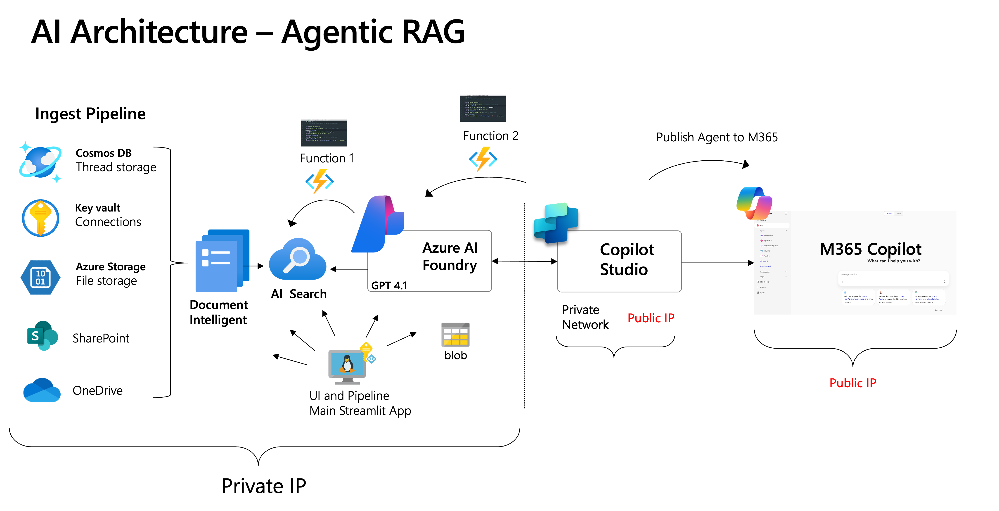

# Agentic RAG Demo

A comprehensive demonstration of Agentic Retrieval-Augmented Generati### 🖥️ Main Application Interface



*The Streamlit-based user interface showing all available tabs and functionality for comprehensive RAG deployment management* Azure using Azure OpenAI, Azure AI Search, and SharePoint integration with advanced document processing capabilities.

## ✨ Key Features

- **🤖 Agentic RAG**: Advanced retrieval-augmented generation with Azure AI Search knowledge agents
- **🏗️ AI Foundry Account Deployment**: Automated deployment of Azure AI Foundry Accounts with network security and private endpoints
- **📄 Multi-format Document Processing**: Support for PDF, DOCX, PPTX, XLSX, CSV, TXT, MD, JSON with unified processing pipeline
- **🖼️ Multimodal Processing**: Advanced image and figure extraction from documents using Azure Document Intelligence
- **🧠 Smart Page-Aware Chunking**: Intelligent document chunking that respects page boundaries and optimizes chunk sizes
- **📊 SharePoint Integration**: Automated indexing and synchronization with SharePoint Online
- **🔒 Secure Authentication**: Multiple authentication methods including client secrets, certificates, and Azure Key Vault
- **🌐 Private Network Support**: Complete private network deployment with VNet integration and private endpoints
- **⚡ Real-time Processing**: Streamlit web interface with live document upload and processing
- **📈 Advanced Analytics**: Comprehensive reporting and monitoring of document processing
- **✅ Document Completeness Verification**: Advanced tools to verify large document indexing integrity

## 🆕 What's New

### Latest Enhancements (July 2025)
- **🎯 Hebrew RAG Accuracy Fix**: Critical fix for Hebrew question answering - now correctly returns "107 days" instead of "5 days" for disconnection timeframe queries
- **🧠 Smart Page-Aware Chunking**: Revolutionary chunking algorithm that respects page boundaries while optimizing chunk sizes for better retrieval
- **📄 Enhanced Page Extraction**: Fixed critical page detection issues - now correctly identifies all pages (1-800) instead of marking everything as "page 1"
- **🔍 Document Completeness Verification**: Advanced diagnostic tools to verify large document indexing integrity and detect missing content
- **⚡ Performance Optimizations**: Improved processing speed and accuracy for large documents (800+ pages)
- **🎯 Better Search Context**: Enhanced page metadata preservation for more accurate search results and citations

### AI Foundry Account Deployment
- **One-Click Deployment**: Deploy complete AI Foundry Accounts with bicep templates
- **Network Security**: Private VNet with subnets and private endpoints
- **Resource Flexibility**: Skip or use existing Azure resources (AI Search, Storage, Cosmos DB)
- **DNS Integration**: Automatic private DNS zone creation and configuration
- **Real-time Monitoring**: Live deployment status tracking and error reporting

### Enhanced Architecture  
- **Modular Design**: Clean separation of concerns with organized module structure
- **Documentation Hub**: All implementation docs moved to `/docs/` folder for better organization
- **Ultra-Fast UI**: Optimized caching and state management for superior user experience

## 📖 Documentation

Comprehensive documentation is now organized in the `/docs/` folder:

### Core Documentation
- **[📚 Complete Documentation Hub](docs/)** - All project documentation and guides
- **[🏗️ Project Structure Guide](docs/PROJECT_STRUCTURE.md)** - Detailed codebase overview
- **[🔧 Modular Development](docs/MODULAR_DEVELOPMENT_WORKFLOW.md)** - Development guidelines and architecture

### Feature Implementation Guides
- **[⚡ Performance Optimizations](docs/ULTRA_FAST_UI_PERFORMANCE_FINAL.md)** - Ultra-fast UI implementation (30x faster)
- **[🎯 Hebrew RAG Fix](docs/status/hebrew_rag_retrieval_accuracy_fix.md)** - Critical accuracy fix for Hebrew question answering
- **[🧠 Smart Chunking Implementation](docs/status/page_extraction_smart_chunking_implementation_complete.md)** - Advanced document processing improvements
- **[📊 SharePoint Integration](docs/technical/sharepoint_indexing_flow_complete.md)** - Complete SharePoint indexing workflow

### Deployment & Infrastructure
- **[🌐 AI Foundry Implementation](docs/AI_FOUNDRY_FINAL_IMPLEMENTATION_SUMMARY.md)** - AI Foundry Account deployment guide
- **[🔐 Private Network Deployment](docs/PRIVATE_NETWORK_DEPLOYMENT_GUIDE.md)** - Enterprise-grade network security setup
- **[🚀 Azure Functions Deployment](docs/AZURE_FUNCTIONS_DEPLOYMENT_GUIDE.md)** - Complete serverless function deployment
- **[🔒 Security & Compliance](docs/SECURITY_COMPLIANCE_GUIDE.md)** - Enterprise security framework and compliance

## 🔍 Document Processing & Verification

### Smart Page-Aware Chunking
Our revolutionary chunking algorithm ensures optimal document processing:

```bash
# Process large documents with smart chunking
python3 agentic-rag-demo.py

# Verify document completeness after indexing
python3 tests/diagnostics/verify_document_completeness.py --index your-index --file "document.docx"
```

**Key Benefits:**
- **📄 Page Boundary Respect**: Maintains document structure and context
- **🎯 Optimal Chunk Sizes**: 3000-character targets with intelligent flexibility
- **🔍 Accurate Page Detection**: Uses Azure Document Intelligence bounding regions
- **📊 Completeness Scoring**: Advanced verification with 90+ completeness scores

### Large Document Support
Specially optimized for enterprise documents:
- **✅ 800+ page documents**: Full support with smart processing
- **🔍 Missing Content Detection**: Identifies gaps in indexed content
- **📈 Performance Analytics**: Real-time processing monitoring
- **🎯 Citation Accuracy**: Proper page number attribution for search results

## 🌐 Agentic RAG Deployment Guide - A to Z

This section provides a comprehensive step-by-step visual guide for deploying the complete Agentic RAG Demo from start to finish, including private endpoints, network security, and AI Foundry integration.

### 🏗️ High-Level Deployment Architecture



*Complete architecture overview showing the Agentic RAG ingest pipeline with Azure AI Foundry, Copilot Studio, private networks, and M365 integration*

### �️ Main Application Interface


*The Streamlit-based user interface showing all available tabs and functionality for comprehensive RAG deployment management*

## 🎯 What This Code Does

This application serves as a **comprehensive orchestration platform** that bridges all the different components in the overall architecture. Here's what you need to know:

### 🔗 **Integration & Orchestration**
- **Connects All Architecture Components**: The code acts as a central hub that integrates Azure AI Search, OpenAI services, Document Intelligence, SharePoint, and AI Foundry components
- **Unified Management Interface**: Provides a single Streamlit-based interface to manage the entire RAG pipeline from document ingestion to query processing

### ☁️ **Resource Management**
- **Does NOT Create Cloud Resources**: This application doesn't provision Azure resources - you must create them separately using Azure Portal, CLI, or ARM templates
- **Configuration & Setup Assistant**: Helps you configure existing Azure resources and verify their connectivity and settings
- **Environment Validation**: Provides comprehensive health checks to ensure all components are properly configured

### 🛡️ **Security & Access Control**
- **RBAC Configuration Helper**: Assists in setting up Role-Based Access Control (RBAC) permissions across Azure services
- **Authentication Management**: Handles various authentication methods including service principals, managed identities, and API keys
- **Private Network Support**: Validates and configures private endpoint connections and VNet integration

### 📄 **Document Processing Pipeline**
- **Multi-Format Document Ingestion**: Processes PDF, DOCX, PPTX, XLSX, CSV, TXT, MD, and JSON files
- **Intelligent Indexing**: Uploads and indexes documents into Azure AI Search with smart chunking and metadata extraction
- **SharePoint Integration**: Automated synchronization and indexing of documents from SharePoint Online libraries

### 🔍 **Query & Retrieval**
- **Agentic RAG Testing**: Provides testing capabilities for the complete retrieval-augmented generation pipeline
- **Real-time Query Processing**: Test and validate your RAG system with live queries and response analysis
- **Performance Monitoring**: Track indexing progress, query performance, and system health

### 💡 **Key Benefits**
- **Rapid Prototyping**: Quickly test and validate your RAG architecture without complex setup
- **Configuration Validation**: Ensure all Azure services are properly connected and configured
- **Document Management**: Streamlined workflow for ingesting and managing large document collections
- **Development & Testing**: Comprehensive testing tools for both document processing and query retrieval

**Think of this as your RAG deployment companion** - it doesn't replace Azure infrastructure setup but makes working with your existing Azure resources much easier and more efficient.

### �📋 Complete Deployment Process

#### Step 1: Deploy AI Foundry Account
%20Deploy%20AI%20Account%20.png)

*Deploy Azure AI Foundry Account with all required services including Azure OpenAI, AI Search, Document Intelligence, and network security*

#### Step 2: Run Private Health Check
%20run%20Private%20Health%20Check%20.png)

*Verify all Azure services are properly deployed and accessible within the private network configuration*

#### Step 3: Create Search Index
%20Create%20Index.png)

*Set up Azure AI Search index with proper schema, vector fields, and document processing configuration*

#### Step 4: Manage Index and Documents
%20Manage%20Index.png)

*Upload and process documents, manage index content, and configure document chunking strategies*

#### Step 5: Run Test Retrieval
%20Run%20Test%20Retrieval.png)

*Test the retrieval system with sample queries and validate search results and knowledge agent responses*

#### Step 6: Configure Function 1 (Document Processing)
%20Function%201%20Config.png)

*Deploy and configure Azure Functions for automated document processing and SharePoint integration*

#### Step 7: Create AI Foundry Agent
%20Create%20AI%20Foundry%20Agent.png)

*Set up knowledge agents in Azure AI Foundry with proper grounding data and conversation flows*

#### Step 8: Configure Function 2 (Studio2Foundry)
%20Function%202%20config%20(Studio2Foundry).png)

*Configure the Studio2Foundry integration for seamless agent deployment and management*

#### Step 9: Set up Virtual Network Support for Power Platform


*Enable Power Platform integration with virtual network support for enterprise-grade security and compliance*

### 🚀 Quick Deployment Commands

```bash
# Clone and setup the project
git clone https://github.com/your-org/agentic-rag-demo.git
cd agentic-rag-demo
python -m venv venv
source venv/bin/activate
pip install -r requirements.txt

# Configure environment
cp .env.example .env
# Edit .env with your Azure service credentials

# Method 1: Universal deployment script (Recommended)
./deploy-ai-foundry.sh your-resource-group [subscription-id]

# Method 2: Manual deployment with relative paths
cd 15-private-network-standard-agent-setup
az deployment group create \
  --resource-group your-rg \
  --template-file main.json \
  --parameters @azuredeploy.parameters.json

# Start the application
cd ..
streamlit run agentic-rag-demo.py
```

### ✨ Deployment Features

- ✅ **Complete AI Foundry Setup**: Automated deployment of Azure AI Foundry Account with all required services
- ✅ **Private Network Security**: Full VNet integration with private endpoints for all Azure services
- ✅ **Document Processing Pipeline**: Automated ingestion from SharePoint, OneDrive, and file uploads
- ✅ **Knowledge Agent Integration**: Seamless connection between search index and AI Foundry agents
- ✅ **Power Platform Support**: Enterprise-grade integration with virtual network security
- ✅ **Health Monitoring**: Comprehensive health checks and real-time status monitoring
- ✅ **Function Automation**: Automated document processing and agent management workflows
- ✅ **Multi-modal Support**: Advanced document intelligence with image and text processing

---

## 🛠️ Quick Start

### Prerequisites
- Python 3.9+
- Azure CLI (`az login` required)
- Azure subscription with appropriate permissions

### Installation

```bash
git clone https://github.com/your-org/agentic-rag-demo.git
cd agentic-rag-demo
python -m venv venv
source venv/bin/activate          # Windows: venv\Scripts\activate
pip install -r requirements.txt
cp .env.example .env              # Edit with your Azure service credentials
streamlit run agentic-rag-demo.py
```

### Authentication

The application uses **Managed Identity (RBAC) Authentication** for Azure AI Search:
- Ensure your application has the "Search Index Data Reader" and "Search Service Contributor" roles assigned on the Azure AI Search service
- This approach eliminates the need to manage API keys and is the recommended method for production deployments

### 🔧 Document Processing & Verification

#### Verify Large Document Indexing
For large documents (especially 800+ page documents), use our completeness verification tool:

```bash
# Verify document completeness after indexing
python3 tests/diagnostics/verify_document_completeness.py --index your-index --file "document.docx" --verbose

# Example output for successful 800-page document:
# ✅ EXCELLENT - Document appears to be fully indexed with high confidence
# Page Range: 1-800 (800 pages with content)  
# Chunk Range: 1-285 (285 unique indices)
# Content: 2,450,123 chars total, 8,596 avg per chunk
# 🎯 COMPLETENESS SCORE: 92/100 (EXCELLENT)
```

#### Smart Chunking Validation
Test the smart chunking improvements:

```bash
# Test page extraction and chunking fixes
python3 tests/debug/simple_page_extraction_validation.py

# Expected results:
# ✅ Page extraction fix: Syntax is valid
# ✅ Smart chunking: Algorithm works correctly  
# 🎉 All validations passed!
```

#### Troubleshooting Document Processing

**Common Issues & Solutions:**

1. **All chunks showing "page 1"**: 
   - ✅ **Fixed** in latest version with proper page extraction from Document Intelligence bounding regions

2. **Missing content in large documents**:
   - Use completeness verification tool to identify gaps
   - Check for Document Intelligence timeouts on very large files
   - Enable verbose logging for detailed processing insights

3. **Poor search relevance**:
   - Verify smart chunking is active with `chunking_method: 'smart_page_aware'`
   - Check page metadata is properly preserved in search index
   - Run test retrieval to validate search quality

**Performance Optimization:**
```bash
# Validate modular architecture
python3 scripts/validate_modular_architecture.py

# Check code quality
python3 tests/debug/validate_phase_1_simple.py
```

### SharePoint Integration

The application can connect to SharePoint to retrieve documents. You can use one of the following authentication methods:

#### Option 1: Client Secret Authentication (Recommended)

1. Register an application in Azure AD for your Agentic app.
2. Grant the application permissions to access SharePoint sites and lists.
3. Add a client secret to your Azure AD app registration.
4. Configure the following environment variables:
   - `SHAREPOINT_TENANT_ID` - Your SharePoint tenant ID
   - `SHAREPOINT_CLIENT_ID` - Application (client) ID of your Azure AD app
   - `SHAREPOINT_CLIENT_SECRET` - Client secret of your Azure AD app
   - `SHAREPOINT_SITE_DOMAIN` - SharePoint site domain (e.g., "yourtenant.sharepoint.com")
   - `SHAREPOINT_SITE_NAME` - SharePoint site name (leave blank for root site)
   - `SHAREPOINT_SITE_FOLDER` - SharePoint folder path (e.g., "/Documents")

#### Option 2: Certificate Authentication

1. Register an application in Azure AD for your Agentic app.
2. Grant the application permissions to access SharePoint sites and lists.
3. Create a self-signed certificate and upload it to your Azure AD app registration.
4. Configure the following environment variables:
   - `SHAREPOINT_TENANT_ID` - Your SharePoint tenant ID
   - `SHAREPOINT_CLIENT_ID` - Application (client) ID of your Azure AD app
   - `AGENTIC_APP_SPN_CERT_PATH` - Path to the certificate file (PEM or PFX)
   - `AGENTIC_APP_SPN_CERT_PASSWORD` - Password for the certificate (if applicable)
   - `SHAREPOINT_SITE_DOMAIN` - SharePoint site domain

#### Option 3: Azure Key Vault for Secrets (Recommended for Production)

For enhanced security, store your SharePoint client secret in Azure Key Vault:
1. Create an Azure Key Vault and store your SharePoint client secret
2. Configure the following environment variables:
   - `AZURE_KEY_VAULT_NAME` - Name of your Azure Key Vault
   - `AZURE_KEY_VAULT_ENDPOINT` - Endpoint URL of your Azure Key Vault
   - `SHAREPOINT_CLIENT_SECRET_NAME` - Name of the secret in Key Vault (default: "sharepointClientSecret")

### Multimodal Processing

The application supports advanced multimodal processing for extracting and analyzing images within documents:

- **Enable Multimodal**: Set `MULTIMODAL=true` in your `.env` file
- **Azure Storage**: Configure `AZURE_STORAGE_CONNECTION_STRING` and `AZURE_STORAGE_CONTAINER` for image storage
- **Supported Formats**: PDF, DOCX, PPTX with embedded images and figures
- **AI-Powered Analysis**: Automatic image captioning and content understanding

---

## Quick‑start

```bash
git clone https://github.com/your‑org/agentic-rag-demo.git
cd agentic-rag-demo
python -m venv venv
source venv/bin/activate          # Windows: venv\Scripts\activate
pip install -r requirements.txt
cp .env.example .env              # fill with your own values
streamlit run agentic-rag-demo.py
```

---

## Application Features

### 📄 Document Processing Pipeline
- **Unified Processing**: All document formats use the same DocumentChunker for consistency
- **Format Support**: PDF, DOCX, PPTX, XLSX, CSV, TXT, MD, JSON with specialized chunkers for each format
- **Azure Document Intelligence**: Advanced OCR and layout analysis for complex documents
- **Metadata Extraction**: Comprehensive metadata including extraction methods, document types, and processing timestamps

### 🔍 Search and Retrieval
- **Hybrid Search**: Combines BM25 keyword search with vector similarity search
- **Agentic RAG**: Knowledge agents provide context-aware responses with proper citations
- **Test Retrieval**: Interactive testing interface for query optimization

### 📊 SharePoint Integration
- **Automated Indexing**: Scheduled processing of SharePoint documents
- **Real-time Sync**: Detection and processing of modified files
- **Comprehensive Reporting**: Detailed processing statistics and success/failure tracking
- **Batch Processing**: Configurable batch sizes and processing schedules

#### 🔄 SharePoint Index Pipeline for Office & PDF Files

The SharePoint index pipeline is a sophisticated multi-stage process that transforms raw documents from SharePoint into intelligently processed, searchable content in Azure AI Search:

**Complete Pipeline Overview:**
```
SharePoint Document → Authentication → Discovery → Download → 
Format Detection → Document Intelligence → Multimodal Processing → 
Chunking → Embedding Generation → Index Storage → Search Ready
```

**🏗️ Stage-by-Stage Process:**

**Stage 1: SharePoint Connection & File Discovery**
- **Authentication**: Certificate-based or client secret authentication via Microsoft Graph API
- **File Discovery**: Recursively scans SharePoint folders for supported file types (`.pdf`, `.docx`, `.pptx`, `.xlsx`)
- **Change Detection**: Compares timestamps to process only modified files
- **Security Preservation**: Maintains original document permissions and access controls

**Stage 2: Document Processing Pipeline**
- **File Download**: Binary content retrieved from SharePoint via Graph API
- **Format Detection**: File extension determines processing strategy
- **Chunker Selection**: ChunkerFactory routes to appropriate processor based on file type

**Stage 3: Azure Document Intelligence Integration**

For **PDF, DOCX, PPTX** files, the system leverages Azure Document Intelligence:
- **OCR Processing**: Extracts text from scanned documents and images
- **Layout Analysis**: Identifies document structure (headers, paragraphs, tables)
- **Table Extraction**: Preserves tabular data structure with relationships
- **Figure Detection**: Identifies and extracts embedded images and figures
- **Coordinate Mapping**: Maintains positional information for accurate content extraction

**Stage 4: Multimodal Processing Enhancement**

When `MULTIMODAL=true` is enabled:
- **Image Extraction**: Extracts embedded images from PDFs and Office documents
- **Azure Blob Storage**: Stores images with unique identifiers and secure access
- **OpenAI GPT-4 Vision**: Generates descriptive captions for images using advanced AI
- **Caption Embedding**: Creates separate embeddings for image descriptions
- **Content Association**: Links images to their corresponding text chunks for contextual search

**Stage 5: Intelligent Chunking Strategies**
- **PDF Processing**: Layout-aware chunking that preserves table structures and reading order
- **Office Documents**: Extracts text while preserving document structure (slides, paragraphs)
- **Excel Files**: Uses Pandas parser to convert tabular data into natural language summaries
- **Adaptive Chunking**: Optimizes chunk sizes based on content type and complexity

**Stage 6: Azure OpenAI Embedding Generation**
- **Model**: `text-embedding-3-large` (3072-dimensional vectors)
- **Content Preparation**: Filename prefix added to chunks for enhanced context
- **Dual Vectors**: Separate embeddings for text content and image captions
- **Batch Processing**: Efficient parallel processing of multiple chunks

**Stage 7: Azure AI Search Index Storage**

Creates a hybrid search index with rich metadata:
```json
{
  "id": "unique_chunk_identifier",
  "page_chunk": "processed_text_content",
  "page_embedding_text_3_large": [3072_dimensional_vector],
  "page_number": 1,
  "source_file": "document.pdf",
  "parent_id": "sharepoint_document_id",
  "url": "sharepoint_document_url",
  
  // SharePoint-specific metadata
  "metadata_storage_path": "sharepoint_web_url",
  "metadata_storage_name": "filename.pdf", 
  "metadata_storage_last_modified": "2024-01-15T10:30:00Z",
  "metadata_security_id": "user_permissions",
  
  // Processing metadata
  "extraction_method": "document_intelligence",
  "document_type": "PDF Document",
  "has_figures": true,
  "processing_timestamp": "2024-01-15T10:30:00Z",
  
  // Multimodal fields (when enabled)
  "imageCaptions": "AI-generated descriptions",
  "captionVector": [caption_embedding_array],
  "relatedImages": ["blob_storage_urls"],
  "isMultimodal": true
}
```

**🎯 Advanced Processing Features:**
- **Smart Retry Logic**: Multiple content-type detection strategies for robust processing
- **Change Detection**: Only processes modified files for efficiency
- **Error Handling**: Comprehensive error tracking and graceful fallback mechanisms
- **Security Preservation**: Maintains SharePoint permissions and access controls
- **Real-time Monitoring**: Live processing status with detailed success/failure reporting

**📊 Processing Outcomes:**
```
✅ Successfully Processed (5 files):
   • Report_Q1.pdf - 12 chunks (document_intelligence) 🎨
   • Data_Analysis.xlsx - 3 chunks (pandas_parser)
   • Meeting_Notes.docx - 8 chunks (document_intelligence)
   • Presentation.pptx - 15 chunks (document_intelligence) 🎨

⚠️ Skipped Files (2 files):
   • Empty_File.pdf (0 bytes) - No content
   • Duplicate_Report.pdf - Already indexed (unchanged)
```

This comprehensive pipeline ensures that Office files and PDFs from SharePoint are transformed into intelligent, searchable knowledge with full multimodal capabilities for enhanced retrieval and contextual understanding.

### ⚙️ Configuration Management
- **Function Deployment**: Automated Azure Function deployment and configuration
- **Environment Sync**: Push configuration changes to Azure Functions
- **Health Monitoring**: Built-in health checks and diagnostics

---

## 🔧 Environment Configuration

This application uses environment variables for configuration. Copy `.env.example` to `.env` and update with your Azure service credentials.

### 🚀 Quick Setup
```bash
cp .env.example .env
# Edit .env with your Azure service credentials
```

### 📋 Environment Variables Reference

Below is a comprehensive guide to all environment variables used by this application, organized by service category:

---

#### 🤖 Azure OpenAI Configuration
Core Azure OpenAI service settings for chat completions and embeddings.

| Variable | Example | Purpose | Required |
|----------|---------|---------|----------|
| `AZURE_OPENAI_ENDPOINT` | `https://your-openai.openai.azure.com/` | Primary OpenAI service endpoint | ✅ **Yes** |
| `AZURE_OPENAI_API_VERSION` | `2025-01-01-preview` | OpenAI API version | ✅ **Yes** |
| `AZURE_OPENAI_DEPLOYMENT` | `gpt-4.1` | Chat model deployment name | ✅ **Yes** |
| `AZURE_OPENAI_SERVICE_NAME` | `your-openai-resource` | Service name (extracted from endpoint) | ✅ **Yes** |
| `AZURE_OPENAI_ENDPOINT_41` | `https://your-openai.openai.azure.com/` | _41 suffix endpoint (auto-populated) | ✅ **Yes** |
| `AZURE_OPENAI_API_VERSION_41` | `2025-01-01-preview` | _41 suffix API version (auto-populated) | ✅ **Yes** |
| `AZURE_OPENAI_DEPLOYMENT_41` | `gpt-4.1` | _41 suffix deployment (auto-populated) | ✅ **Yes** |
| `AZURE_OPENAI_EMBEDDING_DEPLOYMENT` | `text-embedding-3-large` | Embedding model deployment | ✅ **Yes** |
| `AZURE_OPENAI_EMBEDDING_MODEL` | `text-embedding-3-large` | Embedding model name | ✅ **Yes** |
| `AZURE_OPENAI_CHATGPT_DEPLOYMENT` | `gpt-4.1` | Chat deployment (must match actual deployment) | ✅ **Yes** |

> **🔒 Authentication**: When using **Managed Identity** (recommended), comment out or remove any `AZURE_OPENAI_KEY*` variables.

---

#### 📄 Document Intelligence Configuration  
Azure Document Intelligence (Form Recognizer) for advanced document processing.

| Variable | Example | Purpose | Required |
|----------|---------|---------|----------|
| `DOCUMENT_INTEL_ENDPOINT` | `https://your-doc-intelligence.cognitiveservices.azure.com/` | Primary Document Intelligence endpoint | ✅ **Yes** |
| `AZURE_DOCUMENT_INTELLIGENCE_ENDPOINT` | `https://your-doc-intelligence.cognitiveservices.azure.com/` | Alias for MultimodalProcessor compatibility | ✅ **Yes** |
| `AZURE_FORMREC_ENDPOINT` | `https://your-doc-intelligence.cognitiveservices.azure.com/` | Backward compatibility alias | ✅ **Yes** |
| `AZURE_FORMREC_SERVICE` | `https://your-doc-intelligence.cognitiveservices.azure.com/` | Backward compatibility service alias | ✅ **Yes** |

> **📝 Note**: All variables should point to the same Document Intelligence service. Multiple aliases ensure compatibility across different code modules.

---

#### 💾 Azure Storage Configuration
Blob storage for images and multimodal processing.

| Variable | Example | Purpose | Required |
|----------|---------|---------|----------|
| `AZURE_STORAGE_CONTAINER` | `images` | Container name for storing images | ✅ **Yes** |
| `AZURE_STORAGE_ACCOUNT_NAME` | `yourstorageaccount` | Storage account name (for Managed Identity) | ✅ **Yes** |
| `AZURE_STORAGE_ACCOUNT_URL` | `https://yourstorageaccount.blob.core.windows.net` | Storage account URL (for Managed Identity) | ✅ **Yes** |
| `AZURE_STORAGE_CONNECTION_STRING` | `DefaultEndpointsProtocol=https;...` | Connection string (use only if not using Managed Identity) | 🔶 **Optional** |

> **🔒 Security**: Use **Managed Identity** configuration (`ACCOUNT_NAME` + `ACCOUNT_URL`) instead of connection strings for better security.

---

#### 🔍 Azure AI Search Configuration
Azure AI Search service for vector and hybrid search capabilities.

| Variable | Example | Purpose | Required |
|----------|---------|---------|----------|
| `AZURE_SEARCH_ENDPOINT` | `https://your-search-service.search.windows.net` | AI Search service endpoint | ✅ **Yes** |
| `AZURE_SEARCH_SERVICE` | `your-search-service` | AI Search service name | ✅ **Yes** |

---

#### 🎯 Embedding Configuration
Dedicated Azure OpenAI resource for embeddings (can be same as main OpenAI service).

| Variable | Example | Purpose | Required |
|----------|---------|---------|----------|
| `AZURE_OPENAI_EMBEDDING_ENDPOINT` | `https://your-openai.openai.azure.com/` | Dedicated embedding service endpoint | ✅ **Yes** |
| `AZURE_OPENAI_EMBEDDING_API_VERSION` | `2023-05-15` | Embedding API version | ✅ **Yes** |
| `AZURE_OPENAI_EMBEDDING_SERVICE_NAME` | `your-openai-resource` | Embedding service name | ✅ **Yes** |

---

#### ⚡ Function App Configuration
Azure Functions for automated document processing and agent management.

| Variable | Example | Purpose | Required |
|----------|---------|---------|----------|
| `AGENT_FUNC_KEY` | `c97SS6I7odGq...` | Azure Function host key | 🔶 **Optional** |
| `MODEL_DEPLOYMENT_NAME` | `gpt-4.1` | Model deployment for functions | ✅ **Yes** |
| `API_VERSION` | `2025-05-01-preview` | Function API version | ✅ **Yes** |
| `debug` | `false` | Enable debug mode | 🔶 **Optional** |
| `includesrc` | `true` | Include source in responses | 🔶 **Optional** |
| `MAX_OUTPUT_SIZE` | `16000` | Maximum output token size | 🔶 **Optional** |
| `RERANKER_THRESHOLD` | `1` | Reranking threshold | 🔶 **Optional** |
| `TOP_K` | `5` | Number of top search results | 🔶 **Optional** |

---

#### 🔐 SharePoint Authentication
Authentication settings for SharePoint integration.

| Variable | Example | Purpose | Required |
|----------|---------|---------|----------|
| `AZURE_TENANT_ID` | `5aa7c6e1-452d-4ddb-b6b5-85675861b60a` | Azure AD tenant ID | 🔶 **SharePoint** |
| `SHAREPOINT_CLIENT_ID` | `53a49e2d-001f-477d-af20-2485ad0c5888` | SharePoint app client ID | 🔶 **SharePoint** |
| `SHAREPOINT_CLIENT_SECRET` | `your-client-secret` | SharePoint app client secret | 🔶 **SharePoint** |
| `AGENTIC_APP_SPN_CERT_PATH` | `/path/to/certificate.pfx` | Certificate file path (alternative to secret) | 🔶 **SharePoint** |
| `AGENTIC_APP_SPN_CERT_PASSWORD` | `your-cert-password` | Certificate password | 🔶 **SharePoint** |

---

#### 📍 SharePoint Location Configuration
SharePoint site and folder settings.

| Variable | Example | Purpose | Required |
|----------|---------|---------|----------|
| `SHAREPOINT_SITE_DOMAIN` | `yourtenant.sharepoint.com` | SharePoint site domain | 🔶 **SharePoint** |
| `SHAREPOINT_SITE_NAME` | ` ` | Site name (blank for root site) | 🔶 **SharePoint** |
| `SHAREPOINT_DRIVE_NAME` | `Documents` | SharePoint drive/library name | 🔶 **SharePoint** |
| `SHAREPOINT_SITE_FOLDER` | `/your-folder-path` | Specific folder to index | 🔶 **SharePoint** |

---

#### 🔑 Azure Key Vault Configuration
Optional Key Vault integration for secure secret management.

| Variable | Example | Purpose | Required |
|----------|---------|---------|----------|
| `AZURE_KEY_VAULT_ENDPOINT` | `https://your-keyvault.vault.azure.net/` | Key Vault endpoint | 🔶 **Optional** |
| `AZURE_KEY_VAULT_NAME` | `your-keyvault-name` | Key Vault name | 🔶 **Optional** |
| `SHAREPOINT_CLIENT_SECRET_NAME` | `sharepointClientSecret` | Secret name in Key Vault | 🔶 **Optional** |

---

#### ⚙️ SharePoint Connector Configuration
SharePoint integration behavior settings.

| Variable | Example | Purpose | Required |
|----------|---------|---------|----------|
| `SHAREPOINT_CONNECTOR_ENABLED` | `true` | Enable SharePoint connector | 🔶 **SharePoint** |
| `SHAREPOINT_INDEX_DIRECT` | `true` | Enable direct indexing | 🔶 **SharePoint** |
| `SHAREPOINT_OPTIMIZATION_ENABLED` | `true` | Enable processing optimizations | 🔶 **SharePoint** |

---

#### 🎨 Multimodal Configuration
Settings for advanced image and multimodal document processing.

| Variable | Example | Purpose | Required |
|----------|---------|---------|----------|
| `MULTIMODAL` | `true` | Enable multimodal processing | 🔶 **Optional** |
| `CHUNK_OVERLAP` | `200` | Character overlap between chunks | 🔶 **Optional** |

---

### 🔒 Authentication Methods

The application supports multiple authentication methods:

#### 1. **Managed Identity (Recommended)**
- **Best for**: Production deployments with Azure VMs or Container Apps
- **Security**: No secrets in environment variables
- **Setup**: Assign appropriate RBAC roles to your managed identity
- **Required Roles**:
  - `Cognitive Services OpenAI User` (Azure OpenAI)
  - `Search Index Data Reader` + `Search Service Contributor` (AI Search)
  - `Storage Blob Data Reader` (Storage)
  - `Key Vault Secrets User` (Key Vault, if used)

#### 2. **API Keys**
- **Best for**: Development and testing
- **Security**: Store keys securely, never commit to version control
- **Setup**: Add `*_KEY` variables to `.env` file

#### 3. **Certificate Authentication (SharePoint)**
- **Best for**: SharePoint integration with enhanced security
- **Setup**: Upload certificate to Azure AD app registration
- **Variables**: Use `CERT_PATH` and `CERT_PASSWORD` instead of `CLIENT_SECRET`

---

### 🎯 Environment Variable Categories

| **Category** | **Status** | **Description** |
|-------------|------------|-----------------|
| **🤖 Azure OpenAI** | ✅ **Required** | Core AI capabilities for chat and embeddings |
| **📄 Document Intelligence** | ✅ **Required** | Advanced document processing and OCR |
| **🔍 Azure Search** | ✅ **Required** | Vector and hybrid search capabilities |
| **💾 Azure Storage** | ✅ **Required** | Blob storage for images and assets |
| **⚡ Function App** | 🔶 **Optional** | Automated processing and workflows |
| **🔐 SharePoint** | 🔶 **Optional** | Document sync and collaboration |
| **🔑 Key Vault** | 🔶 **Optional** | Enhanced secret management |
| **🎨 Multimodal** | 🔶 **Optional** | Advanced image processing |

---

### 🚀 Quick Configuration Examples

#### **Minimal Configuration (Core Services Only)**
```bash
# Azure OpenAI
AZURE_OPENAI_ENDPOINT=https://your-openai.openai.azure.com/
AZURE_OPENAI_API_VERSION=2025-01-01-preview
AZURE_OPENAI_DEPLOYMENT=gpt-4.1
AZURE_OPENAI_SERVICE_NAME=your-openai-resource

# Document Intelligence  
DOCUMENT_INTEL_ENDPOINT=https://your-doc-intelligence.cognitiveservices.azure.com/

# Azure Search
AZURE_SEARCH_ENDPOINT=https://your-search-service.search.windows.net
AZURE_SEARCH_SERVICE=your-search-service

# Azure Storage
AZURE_STORAGE_ACCOUNT_NAME=yourstorageaccount
AZURE_STORAGE_ACCOUNT_URL=https://yourstorageaccount.blob.core.windows.net
AZURE_STORAGE_CONTAINER=images
```

#### **Full Configuration (All Features)**
```bash
# Use .env.example as template - includes all variables with placeholder values
cp .env.example .env
# Edit .env with your actual service credentials
```

---

## Required local tooling

| Tool | Purpose | Install |
|------|---------|---------|
| **Python 3.9+** | runs Streamlit UI | `pyenv`, Homebrew, Windows installer |
| **Azure CLI (`az`)** | deploy code / update app settings | <https://aka.ms/azure-cli> |
| **Git** | version control | <https://git-scm.com> |
| *(optional)* VS Code + Python ext. | editing & debugging | <https://code.visualstudio.com> |

Sign in: `az login` targeting the subscription that owns your Search, OpenAI and Function resources.

---

## Application Architecture

### Core Components
1. **📄 Document Ingestion** – Upload files via web UI or SharePoint sync with unified processing pipeline
2. **🔍 Hybrid Search** – BM25 + vector search with Azure AI Search for optimal retrieval
3. **🤖 Agentic RAG** – Knowledge agents provide contextual answers with proper citations
4. **📊 SharePoint Sync** – Automated document processing and real-time synchronization
5. **⚙️ Function Management** – Deploy and configure Azure Functions for batch processing

### Processing Pipeline
```
Document Upload → DocumentChunker → Format-Specific Processor → 
Azure Document Intelligence → Embedding Generation → Index Storage → 
Knowledge Agent Retrieval → Contextual Response
```

### Supported Document Formats
- **PDF**: Advanced OCR and layout analysis
- **DOCX/PPTX**: Native Office document processing
- **XLSX/CSV**: Intelligent spreadsheet summarization
- **TXT/MD/JSON**: Text-based format processing
- **Images**: Multimodal analysis with AI-powered captioning

---

## 🏗️ Development Guidelines

### Modular Architecture

This project enforces a **strict modular architecture** to prevent code bloat and maintain maintainability:

- **Main File Limit**: `agentic-rag-demo.py` should remain under 500 lines
- **Current Status**: 🔴 2613 lines (needs refactoring)
- **Rule**: NO new business logic should be added to the main file

### Development Workflow

Before contributing, please follow our modular development workflow:

```bash
# Check architecture compliance
python scripts/validate_modular_architecture.py

# For new features, use existing modular structure:
# - UI components → app/ui/components/ (or create app/tabs/ as needed)
# - Business logic → core/ (azure_clients.py, document_processor.py)
# - Utilities → utils/ (azure_helpers.py, file_utils.py)
# - Health checks → health_check/
# - Integrations → connectors/sharepoint/
```

**Key Resources:**
- **[Development Workflow](MODULAR_DEVELOPMENT_WORKFLOW.md)** - Complete development guidelines
- **[Architecture Guidelines](.github/copilot-instructions.md)** - Copilot instructions for modular development
- **VS Code Task**: "Validate Modular Architecture" - Quick compliance check

### Code Organization

```
📁 Current Project Structure:
├── agentic-rag-demo.py     # Main orchestration ONLY (target: <500 lines)
├── app/                    # UI components & processing
│   ├── ui/components/      # Reusable UI components ✅
│   ├── document_processing/ # Document processing modules ✅
│   ├── openai/             # OpenAI-related functionality ✅
│   └── search/             # Search-related functionality ✅
├── core/                   # Core business logic ✅
│   ├── azure_clients.py    # Azure service clients ✅
│   └── document_processor.py # Document processing ✅
├── utils/                  # Utility functions ✅
│   ├── azure_helpers.py    # Azure utilities ✅
│   ├── file_utils.py       # File operations ✅
│   └── file_format_detector.py # Format detection ✅
├── connectors/             # External integrations ✅
│   └── sharepoint/         # SharePoint integration ✅
├── health_check/           # Health check system ✅
│   ├── health_checker.py   # Health check logic ✅
│   └── health_check_ui.py  # Health check UI ✅
├── chunking/               # Document chunking system ✅
└── scripts/                # Development tools ✅
    └── validate_modular_architecture.py # Architecture validation ✅
```

**Pre-commit Hook**: Automatically validates architecture compliance before each commit.

---

## Troubleshooting

### Common Issues

**BCP177 Bicep Deployment Error** ✅ **RESOLVED**
- **Issue**: BCP177 error during AI Foundry Hub deployment with Bicep templates
- **Solution**: Automatically resolved - deployment service now uses ARM template (`main.json`) instead of Bicep (`main.bicep`)
- **Status**: No user action required - deployments work automatically
- **Verification**: Run `python3 tests/diagnostics/diagnose_sudden_bcp177.py` to confirm fix

**XLSX Processing Failures**
- Ensure `AZURE_OPENAI_CHATGPT_DEPLOYMENT` matches your actual deployment name
- Check that your Azure OpenAI deployment is accessible

**SharePoint Authentication**
- Verify tenant ID, client ID, and secret/certificate configuration
- Ensure proper SharePoint permissions are granted to your app registration

**Multimodal Processing**
- Configure Azure Storage connection string and container
- Verify Document Intelligence service is properly configured

### Error Handling
The application includes comprehensive error handling and fallback mechanisms:
- Graceful degradation when Azure OpenAI is unavailable
- Automatic retry logic for transient failures  
- Detailed logging and error reporting

---

## License

MIT – free for personal or commercial use. Never commit real secrets!
