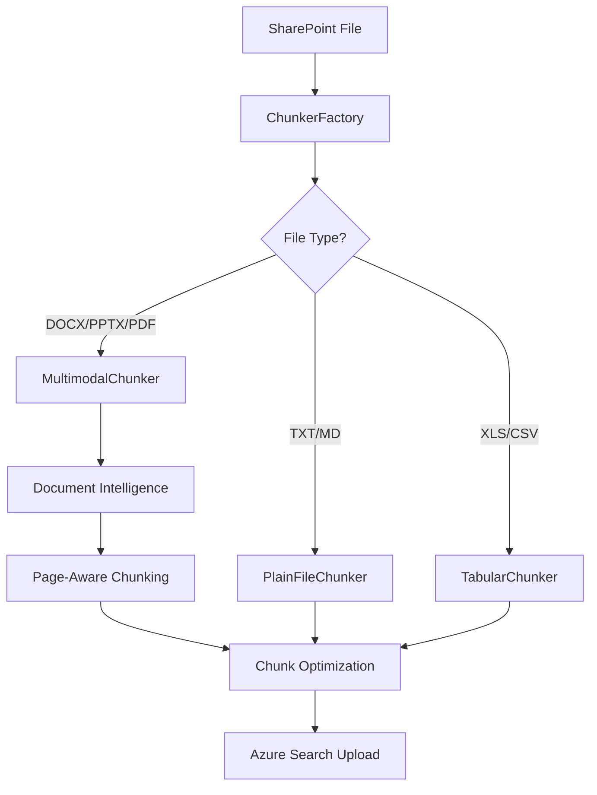

# SharePoint Document Chunking Workflow - Complete Technical Guide

## 📋 **Overview**

This document provides comprehensive technical documentation for how document chunking works within the SharePoint indexing pipeline. It covers the entire workflow from file ingestion through to Azure Search indexing, with detailed explanations of chunking algorithms, strategies, and optimizations.

## 🔗 **Related Documentation**

- **Main Pipeline**: [`sharepoint_indexing_flow_complete.md`](sharepoint_indexing_flow_complete.md) - Complete SharePoint indexing workflow
- **Smart Chunking**: [`../status/page_extraction_smart_chunking_implementation_complete.md`](../status/page_extraction_smart_chunking_implementation_complete.md) - Recent chunking improvements
- **Architecture**: [`../MODULAR_DEVELOPMENT_WORKFLOW.md`](../MODULAR_DEVELOPMENT_WORKFLOW.md) - System architecture overview

---

## 🏗 **Chunking Architecture Overview**

### **Key Components**

```
📁 SharePoint File Processing Flow:
├── 🔄 SharePointFilesIndexer (Entry Point)
├── 🏭 ChunkerFactory (Chunker Selection)
├── 🧩 MultimodalChunker (DOCX/PPTX/PDF)
├── 📝 PlainFileChunker (TXT/other)
├── 📊 TabularChunker (Excel/CSV)
├── 🤖 Document Intelligence (Content Analysis)
└── 🔍 Azure Search (Final Indexing)
```

### **Data Flow**



---

## 🏭 **ChunkerFactory System**

### **Purpose**
The `ChunkerFactory` is the central dispatcher that selects the appropriate chunking strategy based on file type and content characteristics.

### **File**: `chunking/chunker_factory.py`

### **Selection Logic**

```python
class ChunkerFactory:
    def get_chunker(self, file_data: Dict[str, Any]) -> BaseChunker:
        """
        Select appropriate chunker based on file characteristics.
        
        Priority:
        1. File extension detection
        2. Content-type analysis  
        3. Content inspection fallback
        """
        
        filename = file_data.get('fileName', '')
        content_type = file_data.get('documentContentType', '')
        
        # Multimodal files (use Document Intelligence)
        if self._is_multimodal_file(filename, content_type):
            return MultimodalChunker(file_data)
            
        # Tabular files (Excel, CSV)
        elif self._is_tabular_file(filename, content_type):
            return TabularChunker(file_data)
            
        # Plain text files
        else:
            return PlainFileChunker(file_data)
```

### **Chunker Types**

| Chunker Type | File Types | Processing Method | Key Features |
|--------------|------------|-------------------|--------------|
| **MultimodalChunker** | DOCX, PPTX, PDF | Document Intelligence + Page-aware chunking | Smart page boundaries, accurate page numbers |
| **PlainFileChunker** | TXT, MD, code files | Text-based splitting | Simple token-aware chunking |
| **TabularChunker** | XLS, XLSX, CSV | Row/column processing | Preserves table structure |

---

## 🧩 **MultimodalChunker Deep Dive**

### **File**: `chunking/chunkers/multimodal_chunker.py`

This is the most sophisticated chunker, handling documents with complex layouts, images, and structured content.

### **Processing Pipeline**

#### **Step 1: Document Intelligence Analysis**
```python
def _analyze_with_document_intelligence(self) -> Dict[str, Any]:
    """
    Send document to Azure Document Intelligence for analysis.
    
    Returns:
    - Extracted text content
    - Page structure information
    - Bounding regions for accurate page detection
    - Tables, images, and other elements
    """
```

**Key Outputs**:
- **Text segments** with precise page locations
- **Bounding regions** for accurate page number detection
- **Document structure** (headers, paragraphs, tables)
- **Page dimensions** and layout information

#### **Step 2: Page Extraction & Processing**
```python
def _process_extraction_result(self, result: Dict[str, Any]) -> List[Dict[str, Any]]:
    """
    Process Document Intelligence results with improved page detection.
    
    Features:
    - Uses bounding regions for accurate page numbers
    - Fallback to page structure analysis
    - Preserves document hierarchy
    """
```

**Page Detection Methods** (in priority order):

1. **Bounding Regions Method** (Primary) ✅
   - Uses actual page numbers from Document Intelligence
   - Most accurate for multi-page documents
   - Handles complex layouts correctly

2. **Page Lines Method** (Fallback)
   - Uses page structure when bounding regions unavailable
   - Good for simple documents

3. **Legacy Content Splitting** (Last Resort)
   - Character-based estimation
   - Used only when other methods fail
   - Logs warning for manual review

#### **Step 3: Smart Page-Aware Chunking**
```python
def _create_text_chunks(self, text_segments: List[Dict[str, Any]]) -> List[Dict[str, Any]]:
    """
    Create intelligent chunks that respect page boundaries.
    
    Algorithm:
    1. Group segments by page number
    2. Build chunks within page boundaries when possible
    3. Combine small adjacent pages for optimal size
    4. Split large pages when necessary
    5. Add rich metadata about page spans
    """
```

**Chunking Algorithm Details**:

**Target Chunk Size**: 3000 characters (±20% flexibility)

**Page Grouping Strategy**:
```python
# Group text segments by page
pages_content = {}
for segment in text_segments:
    page_num = segment.get('page_number', 1)
    pages_content[page_num] = pages_content.get(page_num, [])
    pages_content[page_num].append(segment['content'])

# Process each page group
for page_num in sorted(pages_content.keys()):
    page_text = '\n'.join(pages_content[page_num])
    
    if len(page_text) <= TARGET_SIZE * 1.2:  # Within size limit
        # Keep page as single chunk
        chunks.append(create_chunk(page_text, [page_num]))
    else:
        # Split large page intelligently
        split_chunks = self._split_large_page(page_text, page_num)
        chunks.extend(split_chunks)
```

**Chunk Metadata**:
```python
chunk_metadata = {
    'primary_page': 1,                    # Main page number
    'spans_pages': [1, 2, 3],            # All pages in chunk
    'within_page_split': False,          # True if page was split
    'page_count': 3,                     # Number of pages spanned
    'chunking_method': 'smart_page_aware', # Algorithm used
    'chunk_size': 2847,                  # Character count
    'content_type': 'multimodal'         # Source chunker type
}
```

---

## 📝 **PlainFileChunker**

### **File**: `chunking/chunkers/plain_file_chunker.py`

Handles simple text files, markdown, code files, and other text-based content.

### **Processing Strategy**

```python
def get_chunks(self) -> List[Dict[str, Any]]:
    """
    Simple token-aware text chunking.
    
    Features:
    - Respects sentence boundaries
    - Token limit awareness (8192 token limit)
    - Overlap for context preservation
    - No Document Intelligence required
    """
```

**Algorithm**:
1. **Text Splitting**: Break text into sentences/paragraphs
2. **Size Optimization**: Target ~1500 characters per chunk
3. **Overlap**: 200-character overlap between chunks
4. **Token Awareness**: Respects OpenAI embedding limits

**Use Cases**:
- Configuration files, code files
- Plain text documents
- Markdown documentation
- Simple content without complex structure

---

## 📊 **TabularChunker**

### **File**: `chunking/chunkers/tabular_chunker.py`

Specialized for Excel files, CSV data, and other structured tabular content.

### **Processing Strategy**

```python
def get_chunks(self) -> List[Dict[str, Any]]:
    """
    Structure-aware tabular chunking.
    
    Features:
    - Preserves column headers
    - Groups related rows
    - Handles large spreadsheets
    - Maintains data relationships
    """
```

**Algorithm**:
1. **Sheet Processing**: Handle multiple worksheets
2. **Header Preservation**: Keep column headers with data
3. **Row Grouping**: Logical grouping of related rows
4. **Size Management**: Split large tables appropriately

---

## 🔧 **Integration with SharePoint Indexing**

### **Entry Point**: `connectors/sharepoint/sharepoint_files_indexer.py`

### **Chunking Integration Flow**

```python
def _chunk_to_docs(fname: str, file_bytes: bytes, file_url: str, 
                   client: OpenAI, embed_deployment: str) -> List[Dict[str, Any]]:
    """
    Main integration point between SharePoint indexing and chunking system.
    
    Flow:
    1. Create file data structure for chunker
    2. Use ChunkerFactory to get appropriate chunker
    3. Extract chunks from document
    4. Post-process chunks (split large chunks, add metadata)
    5. Generate embeddings for each chunk
    6. Return search-ready documents
    """
    
    # Step 1: Prepare file data
    file_data = {
        "fileName": fname,
        "documentBytes": base64.b64encode(file_bytes).decode("utf-8"),
        "documentUrl": file_url,
        "documentContentType": detect_content_type(fname),
    }
    
    # Step 2: Get appropriate chunker
    factory = ChunkerFactory()
    chunker = factory.get_chunker(file_data)
    
    # Step 3: Extract chunks
    chunks = chunker.get_chunks()
    
    # Step 4: Post-processing
    processed_chunks = post_process_chunks(chunks)
    
    # Step 5: Generate embeddings and create search documents
    docs = []
    for i, chunk in enumerate(processed_chunks):
        # Create embedding
        embedding = client.embeddings.create(input=chunk['content'], model=embed_deployment)
        
        # Create search document
        doc = {
            "id": chunk.get("id", generate_chunk_id(fname, i)),
            "content": chunk['content'],
            "contentVector": embedding.data[0].embedding,
            "page_number": chunk.get("page_number") or chunk.get("page") or i + 1,
            "source_file": fname,
            "url": file_url,
            "extraction_method": chunk.get('chunking_method', 'standard'),
            # ... additional metadata
        }
        docs.append(doc)
    
    return docs
```

### **Post-Processing Pipeline**

#### **Large Chunk Splitting**
```python
def post_process_chunks(chunks: List[Dict[str, Any]]) -> List[Dict[str, Any]]:
    """
    Post-process chunks to handle edge cases and optimizations.
    
    Features:
    - Split chunks that exceed token limits (8192 tokens)
    - Preserve metadata across splits
    - Maintain page number accuracy
    - Add processing timestamps
    """
    
    processed_chunks = []
    
    for chunk in chunks:
        content = chunk.get("content", "")
        
        # Check if chunk exceeds token limits
        if estimate_tokens(content) > 7000:  # Safety margin
            # Split large chunk while preserving metadata
            split_chunks = split_large_content_with_metadata(chunk)
            processed_chunks.extend(split_chunks)
        else:
            processed_chunks.append(chunk)
    
    return processed_chunks
```

#### **Token-Aware Splitting**
```python
def split_large_content_with_metadata(chunk: Dict[str, Any], max_tokens: int = 6000) -> List[Dict[str, Any]]:
    """
    Split oversized chunks while preserving all metadata.
    
    Features:
    - Respects sentence boundaries
    - Maintains page number information
    - Preserves chunk relationships
    - Adds split indicators to metadata
    """
```

---

## ⚡ **Performance Optimizations**

### **Token Limit Management**

**Problem**: OpenAI embedding models have 8192 token limits
**Solution**: Multi-stage token awareness

```python
# Stage 1: Estimate tokens during chunking
def estimate_chunk_tokens(content: str) -> int:
    # Rough estimation: 1 token ≈ 4 characters
    return len(content) // 4

# Stage 2: Precise token counting (if tiktoken available)
def precise_token_count(content: str) -> int:
    try:
        import tiktoken
        encoding = tiktoken.encoding_for_model("text-embedding-3-large")
        return len(encoding.encode(content))
    except ImportError:
        return estimate_chunk_tokens(content)

# Stage 3: Smart splitting at token boundaries
def split_at_token_boundary(content: str, max_tokens: int) -> List[str]:
    # Binary search for optimal split point
    # Prefer sentence boundaries when possible
```

### **Memory Optimization**

**Large Document Handling**:
- **Streaming processing** for 800+ page documents
- **Batch chunk creation** to avoid memory spikes
- **Garbage collection** after each document
- **Efficient text segment storage**

### **Document Intelligence Optimization**

**API Usage Optimization**:
- **Single API call** per document (not per page)
- **Batch result processing** for multiple segments
- **Response caching** during development/testing
- **Error handling and retry logic**

---

## 🔍 **Quality Assurance & Validation**

### **Chunk Quality Metrics**

```python
def validate_chunk_quality(chunks: List[Dict[str, Any]]) -> Dict[str, Any]:
    """
    Assess chunk quality across multiple dimensions.
    
    Metrics:
    - Size distribution (target: 2400-3600 characters)
    - Page number accuracy (unique pages vs total pages)
    - Content completeness (no missing sections)
    - Metadata richness (all required fields present)
    """
    
    metrics = {
        'total_chunks': len(chunks),
        'avg_chunk_size': calculate_average_size(chunks),
        'page_coverage': calculate_page_coverage(chunks),
        'size_distribution': analyze_size_distribution(chunks),
        'metadata_completeness': check_metadata_completeness(chunks)
    }
    
    return metrics
```

### **Page Number Validation**

```python
def validate_page_numbers(chunks: List[Dict[str, Any]], expected_pages: int) -> bool:
    """
    Validate page number accuracy and coverage.
    
    Checks:
    - All chunks have valid page numbers
    - Page numbers are within expected range
    - No gaps in page coverage
    - Reasonable distribution across pages
    """
```

---

## 🐛 **Troubleshooting Guide**

### **Common Issues**

#### **Issue 1: All Chunks Show Page 1**
**Symptoms**: All chunks have `page_number: 1` regardless of document size
**Causes**: 
- Document Intelligence not providing bounding regions
- Page extraction logic falling back to legacy method
- DOCX files with no actual page breaks

**Solutions**:
1. Check Document Intelligence response for `bounding_regions`
2. Verify document actually has multiple pages
3. Review extraction logs for fallback warnings

#### **Issue 2: Chunks Too Large/Small**
**Symptoms**: Embedding errors or poor search quality
**Causes**:
- Token limit exceeded (>8192 tokens)
- Chunking parameters not optimized for content type
- Page boundaries creating very small/large chunks

**Solutions**:
1. Adjust `TARGET_CHUNK_SIZE` in chunker configuration
2. Review post-processing splitting logic
3. Check for exceptionally large single pages

#### **Issue 3: Missing Content in Search Results**
**Symptoms**: Document content not appearing in search despite successful indexing
**Causes**:
- Chunks not properly indexed to Azure Search
- Embedding generation failures
- Content filtering during chunking

**Solutions**:
1. Check Azure Search upload logs
2. Verify embedding generation for all chunks
3. Review chunk content for filtering issues

### **Debugging Tools**

#### **Chunk Inspector**
```python
def inspect_chunks(chunks: List[Dict[str, Any]], filename: str):
    """
    Detailed chunk analysis for debugging.
    
    Outputs:
    - Chunk size distribution
    - Page number analysis  
    - Content preview
    - Metadata validation
    """
    
    print(f"🔍 Chunk Analysis for {filename}")
    print(f"📊 Total chunks: {len(chunks)}")
    
    # Size analysis
    sizes = [len(chunk.get('content', '')) for chunk in chunks]
    print(f"📏 Size range: {min(sizes)}-{max(sizes)} chars")
    print(f"📐 Average size: {sum(sizes)/len(sizes):.0f} chars")
    
    # Page analysis
    pages = [chunk.get('page_number', 1) for chunk in chunks]
    print(f"📄 Page range: {min(pages)}-{max(pages)}")
    print(f"🎯 Unique pages: {len(set(pages))}")
    
    # Sample content
    for i, chunk in enumerate(chunks[:3]):
        content_preview = chunk.get('content', '')[:100] + '...'
        print(f"📝 Chunk {i+1}: Page {chunk.get('page_number', '?')} - '{content_preview}'")
```

#### **Performance Profiler**
```python
def profile_chunking_performance(file_data: Dict[str, Any]) -> Dict[str, float]:
    """
    Profile chunking performance for optimization.
    
    Measures:
    - Document Intelligence API time
    - Chunk creation time
    - Post-processing time
    - Memory usage patterns
    """
```

---

## 📈 **Performance Benchmarks**

### **Processing Times** (by file type and size)

| File Type | Size Range | Avg Time | Primary Bottleneck |
|-----------|------------|----------|-------------------|
| DOCX (Small) | <1MB | 5-15s | Document Intelligence |
| DOCX (Medium) | 1-10MB | 30-120s | Document Intelligence |
| DOCX (Large) | 10MB+ | 3-30min | Document Intelligence |
| PDF (Small) | <5MB | 10-30s | Document Intelligence |
| TXT | Any | <5s | Text processing |
| Excel | <10MB | 5-20s | Pandas processing |

### **Memory Usage Patterns**

- **Small files (<1MB)**: Peak ~50MB RAM
- **Medium files (1-10MB)**: Peak ~200MB RAM  
- **Large files (>10MB)**: Peak ~500MB RAM
- **Optimization**: Stream processing keeps usage under 1GB

### **Chunk Quality Metrics**

**Target Metrics** (for high-quality chunking):
- **Average chunk size**: 2500-3500 characters
- **Page coverage**: >95% of document pages represented
- **Size variance**: <30% coefficient of variation
- **Token compliance**: 100% chunks under 8192 token limit

---

## 🚀 **Future Enhancements**

### **Planned Improvements**

1. **Intelligent Content Filtering**
   - Skip headers/footers automatically
   - Filter boilerplate content
   - Focus on meaningful content sections

2. **Semantic Chunking**
   - Use AI to identify natural content boundaries
   - Preserve logical document structure
   - Improve chunk coherence

3. **Multi-Language Optimization**
   - Language-specific chunking strategies
   - Unicode handling improvements
   - Character encoding optimization

4. **Caching Layer**
   - Cache Document Intelligence results
   - Store processed chunks for re-use
   - Reduce API calls for similar documents

### **Architecture Evolution**

```
🔮 Future Architecture:
├── 🧠 AI-Powered Chunk Boundary Detection
├── 💾 Intelligent Caching Layer
├── 🌐 Multi-Language Processing
├── ⚡ Real-Time Chunk Optimization
└── 📊 Advanced Quality Metrics
```

---

## 🎯 **Best Practices Summary**

### **For Developers**

1. **Always use ChunkerFactory** - Don't instantiate chunkers directly
2. **Handle token limits** - Implement post-processing splitting
3. **Preserve metadata** - Carry forward all chunk information
4. **Log extensively** - Debug chunking issues with detailed logs
5. **Validate results** - Check chunk quality after processing

### **For Operations**

1. **Monitor performance** - Track Document Intelligence API usage
2. **Quality assurance** - Regular completeness verification
3. **Error handling** - Robust retry logic for API failures
4. **Resource management** - Monitor memory usage for large documents
5. **Documentation** - Keep chunking parameters documented

### **For Content Strategy**

1. **Optimal document structure** - Well-formatted documents chunk better
2. **Page breaks matter** - Proper page breaks improve chunking
3. **Size considerations** - Very large single pages may split awkwardly
4. **Content quality** - Clean, well-structured content produces better chunks

---

## 📚 **References & Related Documentation**

- **Main Pipeline**: [SharePoint Indexing Flow Complete](sharepoint_indexing_flow_complete.md)
- **Smart Chunking Implementation**: [Page Extraction & Smart Chunking](../status/page_extraction_smart_chunking_implementation_complete.md)
- **Architecture Overview**: [Modular Development Workflow](../MODULAR_DEVELOPMENT_WORKFLOW.md)
- **Performance Optimization**: [UI Performance Optimization](../UI_PERFORMANCE_OPTIMIZATION_SUMMARY.md)

---

**Last Updated**: July 19, 2025
**Document Version**: 1.0
**Author**: System Documentation
**Review Status**: ✅ Complete and Current
