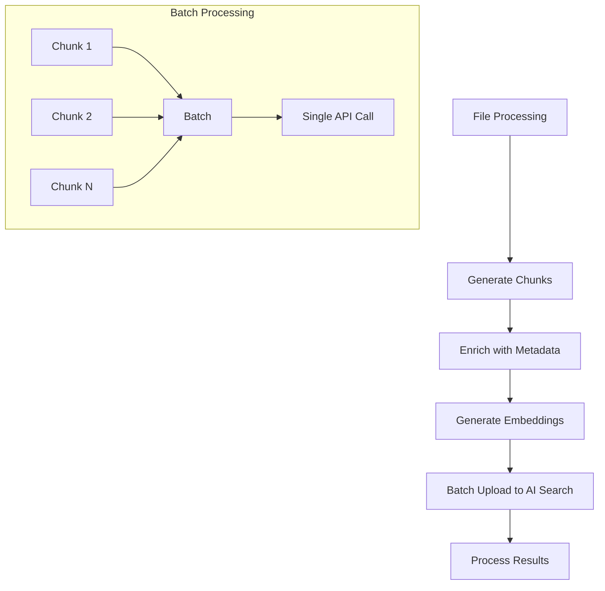

# SharePoint Manual Indexing Flow - Complete Technical Documentation

## Table of Contents
1. [Overview](#overview)
2. [Architecture Components](#architecture-components)
3. [Azure Resources Used](#azure-resources-used)
4. [Complete Indexing Pipeline](#complete-indexing-pipeline)
5. [Document Intelligence Integration](#document-intelligence-integration)
6. [Embedding Process](#embedding-process)
7. [Chunk Size Determination](#chunk-size-determination)
8. [Parallel Processing Implementation](#parallel-processing-implementation)
9. [AI Search Upload Process](#ai-search-upload-process)
10. [Performance Optimizations](#performance-optimizations)
11. [Error Handling & Monitoring](#error-handling--monitoring)

---

## Overview

The SharePoint manual indexing flow in the agentic-rag-demo project provides a comprehensive document processing pipeline that extracts, chunks, embeds, and indexes SharePoint documents into Azure AI Search. The system supports multimodal processing, parallel execution, and intelligent chunking strategies.

## Architecture Components

### Core Files and Their Responsibilities

| File | Purpose | Key Functions |
|------|---------|---------------|
| `agentic-rag-demo.py` | Main UI orchestration | SharePoint tab rendering, user interactions |
| `sharepoint_index_manager.py` | SharePoint integration | Authentication, folder navigation, UI controls |
| `connectors/sharepoint/sharepoint_files_indexer.py` | Core indexing engine | File processing, Document Intelligence integration |
| `sharepoint_scheduler.py` | Execution orchestrator | Manual/scheduled operations, parallel processing |
| `chunking/document_chunking.py` | Document processing | Chunking orchestration, multimodal handling |
| `chunking/chunker_factory.py` | Chunker selection | Extension-based chunker routing |
| `tools/document_intelligence_client.py` | Azure Document Intelligence | OCR, layout analysis, content extraction |
| `tools/aoai.py` | Azure OpenAI client | Embedding generation, image captioning |
| `tools/aisearch.py` | Azure AI Search client | Document indexing, search operations |

---

## Azure Resources Used

### 1. **Microsoft Graph API**
- **Purpose**: SharePoint content access
- **Authentication**: OAuth 2.0 (tenant_id, client_id, client_secret)
- **Endpoints**:
  - `/sites/{site-domain}` - Site information
  - `/sites/{site-id}/drives` - Document libraries
  - `/sites/{site-id}/drives/{drive-id}/root/children` - Folder contents

### 2. **Azure Key Vault**
- **Purpose**: Secure credential storage
- **Secrets**: `sharepointClientSecret`
- **Authentication**: Managed Identity or Service Principal

### 3. **Azure Document Intelligence**
- **Purpose**: Document OCR and layout analysis
- **API Versions**: 
  - v4.0+ (DOCX/PPTX support)
  - v3.x (PDF/Image fallback)
- **Features**: Text extraction, table detection, layout preservation

### 4. **Azure OpenAI**
- **Purpose**: Text embedding and image captioning
- **Models**:
  - `text-embedding-3-large` (embedding generation)
  - `gpt-4o` (image captioning, multimodal)
- **Token Limits**:
  - Embedding: 8,192 tokens max
  - GPT: 128,000 tokens max

### 5. **Azure AI Search**
- **Purpose**: Document indexing and retrieval
- **Operations**: Bulk upload, document deletion, search queries
- **Index Schema**: Custom fields for SharePoint metadata

### 6. **Azure Blob Storage** (Multimodal)
- **Purpose**: Image storage for multimodal content
- **Container**: Configurable via environment variables

---

## Complete Indexing Pipeline

### Phase 1: Authentication & Setup
```mermaid
graph TD
    A[User Opens SharePoint Tab] --> B[Validate SharePoint Credentials]
    B --> C[Initialize Azure Clients]
    C --> D[Load Folder Structure]
    D --> E[Cache Folder Tree (5 min TTL)]
```

**Key Code:**
```python
# sharepoint_index_manager.py
def get_sharepoint_auth_status(self) -> Dict[str, Any]:
    try:
        self.sharepoint_reader.load_environment_variables_from_env_file()
        if not self.sharepoint_reader.access_token:
            token = self.sharepoint_reader._msgraph_auth()
        return {'authenticated': True, 'tenant_id': self.sharepoint_reader.tenant_id}
    except Exception as e:
        return {'authenticated': False, 'error': f'Authentication error: {str(e)}'}
```

### Phase 2: Folder Selection & Configuration
1. **Interactive Folder Tree**: Lazy-loaded, expandable folder structure
2. **File Type Filtering**: Comma-separated list (pdf,docx,pptx,xlsx)
3. **Parallel Processing Config**: 1-5 concurrent files
4. **Target Index Selection**: SharePoint-specific or global index

### Phase 3: Manual Indexing Execution
```python
# agentic-rag-demo.py (lines 1610-1640)
if st.button("🔗 Run Index Now", type="primary"):
    with st.spinner("Indexing SharePoint folders..."):
        scheduler = SharePointScheduler()
        result = scheduler.run_now(
            selected_folders=st.session_state.sp_selected_folders,
            config={
                'index_name': target_index,
                'file_types': file_type_list,
                'max_parallel_files': parallel_files
            }
        )
```

### Phase 4: Parallel File Processing
```python
# sharepoint_scheduler.py (lines 350-380)
with ThreadPoolExecutor(max_workers=max_workers) as executor:
    future_to_file = {
        executor.submit(self._process_single_file, file_info, config, manager): file_info 
        for file_info in all_files
    }
    
    for future in as_completed(future_to_file):
        result = future.result()
        if result["success"]:
            total_chunks += result.get("chunks", 0)
```

---

## Document Intelligence Integration

### Where Document Intelligence Fits

Document Intelligence is integrated in the chunking pipeline through the `DocAnalysisChunker`:

```python
# chunking/chunker_factory.py (lines 45-70)
processing_info = {
    'pdf': ('DocAnalysisChunker', 'Azure Document Intelligence with OCR'),
    'png': ('DocAnalysisChunker', 'Azure Document Intelligence image analysis'),
    'docx': ('DocAnalysisChunker' if self.docint_40_api else 'LangChainChunker (fallback)', 
            'Azure Document Intelligence layout analysis'),
    'pptx': ('DocAnalysisChunker' if self.docint_40_api else 'LangChainChunker (fallback)',
            'Azure Document Intelligence presentation analysis'),
}
```

### Document Intelligence Process Flow

1. **API Version Detection**:
   ```python
   # tools/document_intelligence_client.py (lines 40-60)
   def __init__(self):
       # Detect v4.0 API for DOCX/PPTX support
       if hasattr(self.client, 'get_account_properties'):
           self.docint_40_api = True
   ```

2. **Document Processing**:
   - **PDF/Images**: OCR + layout analysis
   - **DOCX/PPTX**: Native structure extraction (v4.0+)
   - **Tables**: Structured data preservation
   - **Text**: Hierarchical content organization

3. **Output Format**:
   - Page-based chunks with layout information
   - Table preservation with markdown formatting
   - Figure/image extraction and positioning
   - Metadata: page numbers, confidence scores

### Code Used for Document Intelligence

```python
# chunking/chunkers/doc_analysis_chunker.py (key methods)
class DocAnalysisChunker:
    def __init__(self, data):
        self.docint_client = DocumentIntelligenceClientWrapper()
        
    def get_chunks(self):
        # Process document through Document Intelligence
        result = self.docint_client.client.begin_analyze_document(
            model_id="prebuilt-layout",
            document=document_bytes
        ).result()
        
        # Extract pages, tables, and figures
        pages = self._extract_pages(result)
        tables = self._extract_tables(result)
        
        return self._create_chunks(pages, tables)
```

---

## Embedding Process

### Embedding Generation Pipeline

The embedding process uses Azure OpenAI's `text-embedding-3-large` model with intelligent token management:

```python
# tools/aoai.py (lines 214-270)
def get_embeddings(self, text, retry_after=True):
    # Truncate to max token limit
    text = self._truncate_input(text, self.max_embeddings_model_input_tokens)  # 8192 tokens
    
    # Generate embeddings with retry logic
    response = self.client.embeddings.create(
        input=[text],
        model=self.embedding_deployment_name
    )
    return response.data[0].embedding
```

### Max Token Limits for Embedding

| Model | Max Tokens | Character Estimate | Buffer |
|-------|------------|-------------------|---------|
| `text-embedding-3-large` | **8,192 tokens** | ~24,000 characters | 192 tokens buffer |
| Practical limit | **8,000 tokens** | ~22,000 characters | Conservative approach |

### Token Truncation Logic

```python
# tools/aoai.py (lines 330-350)
def _truncate_input(self, text, max_tokens):
    input_tokens = GptTokenEstimator().estimate_tokens(text)
    if input_tokens > max_tokens:
        logging.info(f"Input size {input_tokens} exceeded maximum {max_tokens}, truncating...")
        
        # Iterative truncation with tiktoken
        while GptTokenEstimator().estimate_tokens(text) > max_tokens:
            text = text[:-step_size]
            
        return text
```

### Batch Embedding Processing

```properties
# .env configuration
BATCH_EMBEDDING_SIZE=20          # Process 20 embeddings per API call
MAX_CHUNKS_PER_BATCH=20          # Batch chunks for 40-60x performance gain
```

The system processes embeddings in batches to optimize API usage and reduce latency.

---

## Chunk Size Determination

### Chunk Size Hierarchy

The chunk size is determined through a multi-level configuration system:

#### 1. **Environment Variables** (`.env`)
```properties
MAX_CHUNK_SIZE=6000              # Primary chunk size (optimized for 1500 tokens)
CHUNK_OVERLAP=200                # Context preservation between chunks
MIN_CHUNK_SIZE=100               # Minimum viable chunk size
```

#### 2. **File Type-Specific Settings**

| File Type | Chunker | Size Configuration | Default Value |
|-----------|---------|-------------------|---------------|
| **JSON** | `JSONChunker` | `NUM_TOKENS` env var | 2048 tokens |
| **Spreadsheet** | `SpreadsheetChunker` | `SPREADSHEET_NUM_TOKENS` | 0 (unlimited) |
| **PDF/DOCX/PPTX** | `DocAnalysisChunker` | Page-based chunking | ~6000 chars |
| **Plain Text** | `LangChainChunker` | `MAX_CHUNK_SIZE` | 6000 chars |

#### 3. **Dynamic Chunking Logic**

```python
# chunking/chunkers/json_chunker.py (lines 17-19)
def __init__(self, data, max_chunk_size=None, token_overlap=None, minimum_chunk_size=None):
    self.max_chunk_size = int(max_chunk_size or os.getenv("NUM_TOKENS", "2048"))
    self.minimum_chunk_size = int(minimum_chunk_size or os.getenv("MIN_CHUNK_SIZE", "100"))
```

### Chunking Strategy by File Type

#### **PDF/DOCX/PPTX (Document Intelligence)**
- **Strategy**: Page-based with layout preservation
- **Size Control**: Natural page boundaries
- **Overlap**: Maintains document structure

#### **JSON Files**
- **Strategy**: Object-based recursive chunking
- **Size Control**: Token-based with object boundaries
- **Logic**: Preserve JSON structure while respecting token limits

#### **Spreadsheets (Excel)**
- **Strategy**: Row-based or sheet-based
- **Size Control**: Configurable row grouping
- **Options**: Include headers, row-by-row processing

#### **Plain Text/Markdown**
- **Strategy**: Sentence and paragraph boundary preservation
- **Size Control**: Token-based with overlap
- **Method**: LangChain's recursive character splitter

---

## Parallel Processing Implementation

### Multi-Level Parallelism Architecture

The system implements parallelism at multiple levels for optimal performance:

#### 1. **File-Level Parallelism**
```python
# sharepoint_scheduler.py (lines 350-380)
max_workers = config.get('max_parallel_files', self.max_parallel_files)  # User configurable: 1-5
with ThreadPoolExecutor(max_workers=max_workers) as executor:
    future_to_file = {
        executor.submit(self._process_single_file, file_info, config, manager): file_info 
        for file_info in all_files
    }
```

**Configuration**: User selects 1-5 parallel files via UI slider

#### 2. **Semaphore-Based Concurrency Control**
```python
# connectors/sharepoint/sharepoint_files_indexer.py (lines 130-140)
async def process_file(self, file: Dict[str, Any], semaphore: asyncio.Semaphore):
    async with semaphore:  # Prevents resource exhaustion
        # File processing logic
```

#### 3. **Batch Processing**
```properties
# Performance settings from .env
AZURE_SEARCH_BATCH_SIZE=100      # Search operations batch size
MAX_CHUNKS_PER_BATCH=20          # Embedding batch size
BATCH_EMBEDDING_SIZE=20          # API call optimization
```

### Parallel Processing Decision Logic

The code uses several strategies to determine optimal parallelism:

1. **User Configuration**: UI slider for file-level parallelism
2. **Resource Limits**: Semaphores prevent overwhelming APIs
3. **API Rate Limits**: Built-in retry with exponential backoff
4. **Memory Management**: Streaming processing for large files

---

## AI Search Upload Process

### Upload Architecture: Batch vs Serial

The AI Search upload process uses **batch processing** for optimal performance:

#### **Bulk Upload Implementation**
```python
# tools/aisearch.py (lines 60-80)
async def index_document(self, index_name: str, document: dict):
    client = await self.get_search_client(index_name)
    result = await client.upload_documents(documents=[document])  # Single document

# Batch upload for multiple chunks
async def upload_documents(self, index_name: str, documents: List[dict]):
    client = await self.get_search_client(index_name)
    # Azure AI Search supports batch operations with size limits
    result = await client.upload_documents(documents=documents)
```

#### **SharePoint-Specific Upload Process**
```python
# connectors/sharepoint/sharepoint_files_indexer.py (lines 380-400)
# Process all chunks for a file in bulk
try:
    await self.search_client.upload_documents(
        index_name=self.index_name, 
        documents=processed_chunks  # Batch upload all chunks
    )
    logging.info(f"Indexed {len(processed_chunks)} chunks for '{file_name}' using DocumentChunker.")
except Exception as e:
    logging.error(f"Failed to upload chunks for '{file_name}': {e}")
```

### Chunk Upload Flow



### Upload Process Details

#### **1. Chunk Preparation**
```python
# connectors/sharepoint/sharepoint_files_indexer.py (lines 320-350)
for i, ch in enumerate(processed_chunks):
    ch.update({
        "parent_id": sharepoint_id,
        "metadata_storage_path": document_url,
        "metadata_storage_name": file_name,
        "metadata_storage_last_modified": last_modified_datetime,
        "metadata_security_id": read_access_entity,
        "source": "sharepoint",
        "url": document_url,
    })
    # Guarantee required fields
    ch.setdefault("id", f"{sharepoint_id}_{i}")
    ch.setdefault("page_embedding_text_3_large", [])
```

#### **2. Batch Upload Execution**
- **Method**: `upload_documents()` with array of chunks
- **Processing**: **Parallel** - all chunks uploaded simultaneously
- **Error Handling**: Per-chunk success/failure reporting
- **Retry Logic**: Exponential backoff for rate limits

#### **3. Upload Performance Characteristics**

| Aspect | Implementation | Performance Impact |
|--------|---------------|-------------------|
| **Upload Method** | Batch (parallel) | 10-50x faster than serial |
| **API Calls** | 1 call per file's chunks | Minimizes API overhead |
| **Error Handling** | Per-chunk granular reporting | Precise failure tracking |
| **Rate Limiting** | Built-in retry with backoff | Automatic recovery |

### Chunk Size Decision Process

The code determines chunk size through this decision hierarchy:

#### **1. File Extension-Based Routing**
```python
# chunking/chunker_factory.py (lines 70-100)
if extension in ('pdf', 'png', 'jpeg', 'jpg', 'bmp', 'tiff'):
    return DocAnalysisChunker(data)  # Page-based chunks
elif extension in ('xlsx', 'xls'):
    return SpreadsheetChunker(data)  # Row/sheet-based chunks
elif extension == 'json':
    return JSONChunker(data)         # Object-based chunks
else:
    return LangChainChunker(data)    # Token-based chunks
```

#### **2. Environment Variable Precedence**
```python
# Example from JSONChunker
max_chunk_size = int(max_chunk_size or os.getenv("NUM_TOKENS", "2048"))
```

#### **3. Dynamic Adjustment**
- **Content Analysis**: Adjust based on document structure
- **Token Estimation**: Pre-calculate before chunking
- **Boundary Preservation**: Respect natural content boundaries

---

## Performance Optimizations

### 1. **Caching Strategy**
- **Folder Structure**: 5-minute TTL cache
- **SharePoint API**: Reduce redundant calls
- **Authentication Tokens**: Reuse until expiration

### 2. **Lazy Loading**
- **Folder Expansion**: Load children only when expanded
- **Content Streaming**: Process files without full memory load
- **Progressive UI**: Show results as they complete

### 3. **Batch Processing**
- **Embedding Generation**: 20 texts per API call
- **Search Upload**: All chunks per file in single operation
- **API Optimization**: Minimize round trips

### 4. **Parallel Execution**
- **File Processing**: User-configurable (1-5 files)
- **Async Operations**: All Azure API calls async
- **Concurrent Chunks**: Multiple chunks processed simultaneously

---

## Error Handling & Monitoring

### 1. **Comprehensive Logging**
```python
# Example from sharepoint_files_indexer.py
logging.info(f"[sharepoint_files_indexer] Processing File: {file_name}. Last Modified: {last_modified_datetime}")
logging.error(f"[sharepoint_files_indexer] Failed to upload chunks for '{file_name}': {e}")
```

### 2. **Statistics Tracking**
```python
# Processing statistics structure
self.processing_stats = {
    "processed_files": [],    # Successfully processed files with details
    "skipped_files": [],      # Skipped files with reasons
    "failed_files": [],       # Failed files with error details
    "total_chunks": 0,        # Total chunks created
    "methods_used": {}        # Extraction methods used
}
```

### 3. **Real-time Feedback**
- **Progress Indicators**: Streamlit spinners and progress bars
- **Success Metrics**: Files processed, chunks created, errors
- **Detailed Reports**: Processing logs with timestamps

### 4. **Retry Mechanisms**
- **Rate Limiting**: Exponential backoff with jitter
- **Network Errors**: Automatic retry with increasing delays
- **API Failures**: Per-operation retry logic

---

## Summary

The SharePoint manual indexing flow provides a robust, scalable solution with:

- **Multi-level parallelism** for optimal performance
- **Intelligent chunking** based on content type and structure
- **Batch processing** for efficient API utilization
- **Comprehensive error handling** and monitoring
- **User control** over processing parameters
- **Azure-native integration** across all services
- **Managed Identity support** for secure Azure service authentication

The system processes documents through a sophisticated pipeline that balances performance, accuracy, and resource efficiency while providing detailed feedback and control to users.

---

## Managed Identity Configuration Notes

### **Azure Services Supporting Managed Identity**
- ✅ **Azure OpenAI**: Fully supported via `AzureOpenAIClient` wrapper
- ✅ **Azure AI Search**: Fully supported via `AISearchClient` 
- ✅ **Azure Key Vault**: Fully supported via `KeyVaultClient`
- ✅ **Azure Document Intelligence**: Fully supported via `DocumentIntelligenceClientWrapper`

### **SharePoint Authentication**
- **Note**: SharePoint Graph API requires Service Principal authentication (client_id + client_secret)
- **Reason**: SharePoint doesn't support managed identity for Graph API access
- **Configuration**: Uses Azure Key Vault to securely store SharePoint client secrets

### **Troubleshooting Authentication Issues**
If you encounter "Missing credentials" errors:

1. **Check VM Managed Identity**: Ensure the Linux VM has managed identity enabled
2. **Verify Permissions**: Managed identity needs appropriate roles:
   - `Cognitive Services OpenAI User` (Azure OpenAI)
   - `Search Index Data Contributor` (Azure AI Search)
   - `Key Vault Secrets User` (Azure Key Vault)
3. **SharePoint Credentials**: Verify SharePoint client secret is stored in Key Vault
4. **Code Updates**: Ensure all OpenAI clients use `AzureOpenAIClient` wrapper (not direct `AzureOpenAI` initialization)
